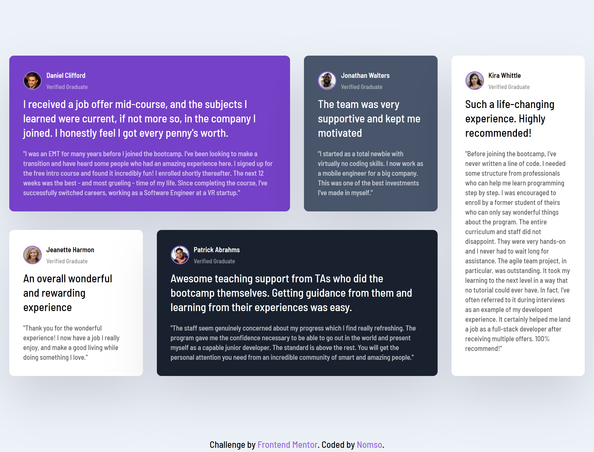

# Frontend Mentor - Testimonials grid section solution

This is a solution to the [Testimonials grid section challenge on Frontend Mentor](https://www.frontendmentor.io/challenges/testimonials-grid-section-Nnw6J7Un7). Frontend Mentor challenges help you improve your coding skills by building realistic projects. 

## Table of contents
  - [The challenge](#the-challenge)
  - [Screenshot](#screenshot)
  - [Links](#links)
  - [Built with](#built-with)
  - [Useful resources](#useful-resources)
-   [Author](#author)

### The challenge

Users should be able to:
- View the optimal layout depending on their device's screen size

### Screenshot

- Desktop view: 

### Links

- Solution URL: https://heynomso.github.io/Testimonials-grid-section/
- Repository URL: https://github.com/heynomso/Testimonials-grid-section

### Built with

- Semantic HTML5 markup
- CSS custom properties
- Grid Layout
- Desktop-first workflow
- SCSS (Sassy Cascading Style Sheets) - For nesting CSS code

### Useful resources

- [Grid crash Course](https://youtu.be/0xMQfnTU6oo) - This helped me understand Grid layout better.

## Author

- Github - [@heynomso](https://github.com/heynomso)
- Frontend Mentor - [@heynomso](https://www.frontendmentor.io/profile/heynomso)
- Twitter - [@heynomso](https://twitter.com/heynomso)
